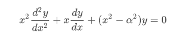

# SciPy 가이드
Scipy는 Numpy 라이브러리를 기반으로한 수치연산을 빠르게 할 수 있도록 도와주는 라이브러리 입니다. 

Ref URL : [https://scipy.github.io/devdocs/tutorial/general.html](https://scipy.github.io/devdocs/tutorial/general.html)

### 소개 
SciPy는 파이썬의 Numpy 확장을 기반으로 구축된 수학적 알고리즘 및 편의 기능 모음이다. 사용자에게 데이터 조작 및 시각화를 위한 고급 명령 및 클래스를 제공하여 대화형 파이썬 세션에 상당한 기능을 추가한다. SciPy를 사용하면 대화형 파이썬 세션이 MATLAB, IDL, Octave, R-Lab 및 SciLab과 같은 시스템에 필적하는 데이터 처리 및 시스템 프로토타이핑 환경이 된다. 

파이썬을 기반으로 하는 SciPy의 추가 이점은 정교한 프로그램 및 특수 응용 프로그램 개발에 사용할 수 있는 강력한 프로그래밍 언어를 제공한다는 것이다.  SciPy를 사용하는 과학 응용 프로그램은 전 세계 개발자가 소프트웨어 환경의 수많은 틈새에서 추가 모듈을 개발하는 이점을 얻을 수 있다. 병렬 프로그래밍에서 웹 및 데이터베이스 서브루틴과 클래스에 이르기까지 모든 것이 Python 프로그래머에게 제공되었다. 이 모든 기능은 SciPy의 수학 라이브러리와 함께 사용할 수 있다. 

이 문서는 SciPy를 처음 사용하는 사용자에게 가장 중요한 몇가지 기능을 알려준다. 사용자가 이미 SciPy 패키지를 설치했다고 가정하고, 파이썬 배포의 Tutorial을 통해 작업하여 얻을 수 있는 것과 같은 일부 일반 파이썬 기능도 가정된다. 추가 소개 도움말을 보려면 사용자가 Numpy 문서로 이동하라. 

기본으로 사용하는 라이브러리이다. 기본 !!
```python
import numpy as np 
import matplotlib as mpl 
import matplotlib.pyplot as plt 

```


### SciPy 조직 
SciPy는 다양한 과학 컴퓨팅 영역을 다루는 하위 패키지로 구성되어 있습니다. 다음 표에 요약되어 있다. 

|서브팩키지(Subpackage)| 설명|
|----------------------|----|
|cluster| 클러스터 알고리즘들|
|constants| 물리 및 수학 상수|
|fftpack|Fast Fourier Transform routines |
|integrate| 적분 및 상미분 방정식 솔버|
|interpolate|보간 및 스플라인 평활화 (interpolation and smoothing splines)|
|io| 입력 과 출력 |
|linalg| 선형 대수학|
|ndimage|N차원 이미지 처리|
|odr|직교 거리 회귀|
|optimize|최적화 및 루트 찾기 루틴|
|signal|시그널 프로세싱|
|sparse|희소 행렬 및 관련 루틴|
|spatial|공간 데이터 구조 및 알고리즘|
|special|특수 기능|
|stats|통계 분포 및 함수|

SciPy 하위 패키지는 별도로 가져와야 한다. 예를 들면 다음과 같이 (당연한거 아닌가 ㅋㅋㅋ)

```python
from scipy import linalg, optimize 
```
유비쿼터스 때문에 이러한 하위 패키지의 일부 기능은 scipy 네임스페이스에서도 사용 가능하여 대화식 세션 및 프로그램에서 쉽게 사용할 수 있습니다. 또한 numpy의 많은 기본 배열 함수는 scipy 패키지의 최상위 수준에서도 사용할 수 있다. 하위 패키지를 개별적으로 보기 전에 먼저 이러한 공통 기능 중 일부를 보도록 하자. 

### 문서 찾기 
```python
pass 
```

### 특수 함수(scipy.special)
scipy.special 패키지의 주요 기능은 수학 물리학의 수많은 특수 기능에 대한 정의입니다. 사용 가능한 기능에는 airy, elliptic, bessel, gamma, beta, hypergeometric, parabolic cylinder, mathieu, spheroidal wave, struve 및 kelvin이 있다. stats 모듈에서 이러한 기능에 대한 더 슁누 인터페이스를 제공하므로 일반적인 용도로 사용되지 않는 일부 저수준 통계 기능도 있다. 이러한 함수의 대부분은 배열 인수를 취하고 Numerical Python의 다른 수학함수와 동일한 브로드캐싕 규칙에 따라 배열 결과를 반환할 수 있다. 이러한 함수 중 다수는 복소수를 입력으로도 허용한다. 한 줄 설명 유형으로 사용 가능한 기능의 전체 목록을 보려면 `>>> help(special)` 라고 치면 됨. 각 기능에는 도움말을 사용하여 액세스할 수 있는 자체 설명서가 있다. 필요한 기능이 없으면 작성하여 라이브러리에 제공하는 것을 고려하십시오. C, Fortran 또는 Pyton 으로 함수를 작성할 수 있다. 이러한 종류의 함수 각각에 대한 예제는 라이브러리의 소스 코드를 참조하라. 

### 실제 차수의 베셀 함수 (jv, jn_zeros)
베셀 함수는 실수 또는 복소수 알파를 사용하는 베셀의 미분방정식에 대한 솔루션 제품군이다. 


다른 용도 중에서 이러한 기능은 얇은 드럼 헤드의 진동 모드와 같은 파동 전파 문제에서 발생한다. 다음은 가장자리에 고정된 원형 드럼 헤드의 예이다. 
```python
from scipy import special
def drumhead_height(n, k, distance, angle, t):
    kth_zero = special.jn_zeros(n, k)[-1]
    return np.cos(t) * np.cos(n*angle) * special.jn(n, distance * kth_zero)

theta = np.r_[0:2*np.pi:50j]
radius = np.r_[0:1:50j]
x = np.array([r * np.cos(theta) for r in radius])
y = np.array([r * np.sin(theta) for r in radius])
z = np.array([drumhead_height(1, 1, r, theta, 0.5) for r in radius])

import matplotlib.pyplot as plt 

fig = plt.figure()
ax = fig.add_axes(rect = (0, 0.05, 0.95, 0,95), projection = '3d')
ax.plot_surface(x, y, z, rstride = 1, cstride = 1, cmap = 'RdBu_r', vmin = -0.5, vmax = 0.5)
ax.set_xlabel('X')
ax.set_ylabel('Y')
ax.set_xticks(np.arange(-1, 1.1, 0.5))
ax.set_yticks(np.arange(-1, 1.1, 0.5))
ax.set_zlabel('Z')
plt.show()

```
### 특수 기능을 위한 Cython 바인딩 (scipy.special.cython_special)
SciPy 는 또한 스칼라에 대한 Cython 바인딩을 제공한다. 다음 Cython 코드는 이러한 기능을 사용하는 방법에 대한 간단한 예를 제공한다. 

```python
cimport scipy.special.cython_special as csc 

cdef:
    double x = 1
    double complex z = 1 + 1j
    double si, ci, rgam
    double complex cgam

rgam = csc.gamma(x)
print(rgam)
cgam = csc.gamma(z)
print(cgam)
csc.sici(x, &si, &ci)
print(si, ci)
```

예제에서 csc.gamma 함수는 numpy배열 대신 C 유형을 인수로 사용하지만 본질적으로 ufunc 대응 감마처럼 작동한다. 특히,  함수는 실수 및 복소수 인수를 지원하도록 오버로드된다는 점에 유의하라. 컴파일 타임에 올바른 변형이 선택된다. 함수 csc.sici는 sici와 약간 다르게 작동한다. ufunc의 경우 ai, bi = sici(x)를 작성할 수 있지만 Cython 버전에서는 여러 반환 값이 포인터로 전달된다. 이것을 출력 배열 sici(x, out=(si, ci))로 ufunc를 호출하는 것과 유사하다고 생각하는 것이 도움이 될 수 있다. 

Cython 바인딩을 사용하면 두 가지 잠재적인 이점이 있다. 
* 그들은 파이썬 함수 오버 헤드를 피한다. 
* Python GIL(Global Interpreter Lock)이 필요하지 않다. 

다음 섹션에서는 이러한 이점을 사용하여 잠재적으로 코드 속도를 높이는 방법에 대해 설명한다. 물론 추가 노력을 기울일 가치가 있는지 확인하려면 항상 코드를 먼저 프로파일링해야한다. 

### 파이썬 함수 오버헤드 피하기 
특별한 ufunc의 경우 벡터화, 즉 함수에 배열을 전달하여 Python 함수 오버헤드를 방지한다. 일반적으로 이 접근 방식은 매우 잘 작동하지만, 예를 들어 고유한 ufunc를 구현할 때 루프 내부의 스칼라 입력에 대해 특수 함수를 호출하는 것이 더 편리한 경우가 있다. 이 경우 파이썬 함수 오버헤드가 커질 수 있다. 다음 예를 고려하라. 

```python 
import scipy.special as sc 
cimport scipy.special.cython_special as csc 

def python_tight_loop():
    cdef:
        int n
        double x = 1
    for n in range(100):
        sc.jv(n, x)
def cython_tight_loop():
    cdef:
        int n
        double x = 1

    for n in range(100):
        csc.jv(n, x)
```